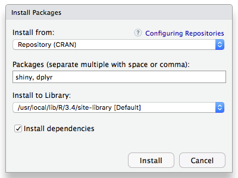
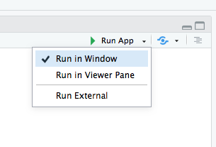

# BedbuggerCoder Docs

## Installation

1. Install [RStudio Desktop](https://www.rstudio.com/products/rstudio/download/#download)
1. Open RStudio
    1. Find “Tools > Install Packages …” in the menu bar.
    1. Install “shiny” and “dplyr” 
1. Download [BedbuggerCoder.zip](http://sesync.us/xa1f3) using password 'islandcreek'.
1. Unzip “BedbuggerCoder.zip”, move the "BedbuggerCoder" folder to your preferred directory.
1. Open the “app.R” file with RStudio.
1. Set “Run App” to "Run in Window" 
1. Click "Run App" to launch the app.

## Useage

1. Use the “Codes” tab for importing and exporting codes.

